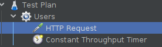
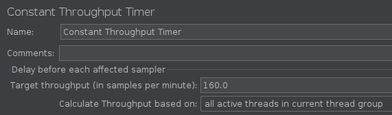
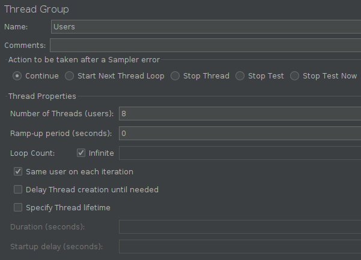
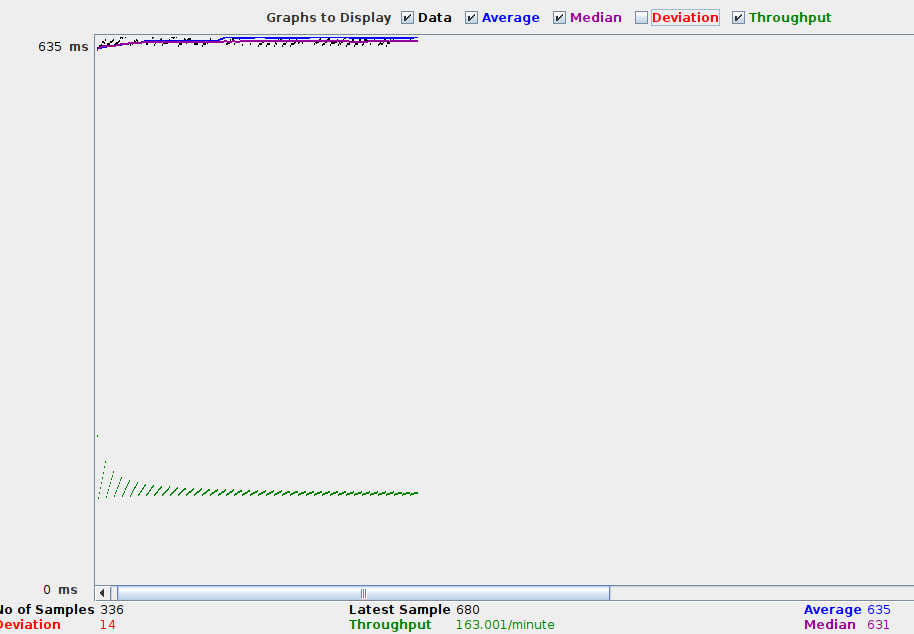
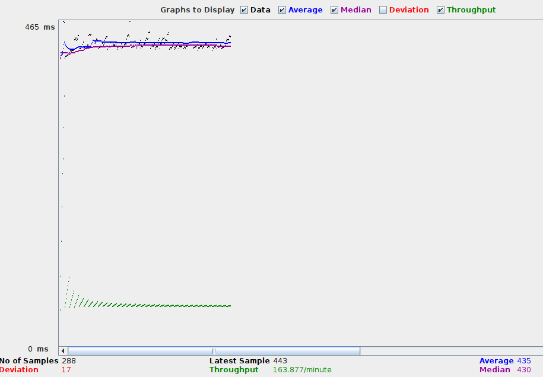
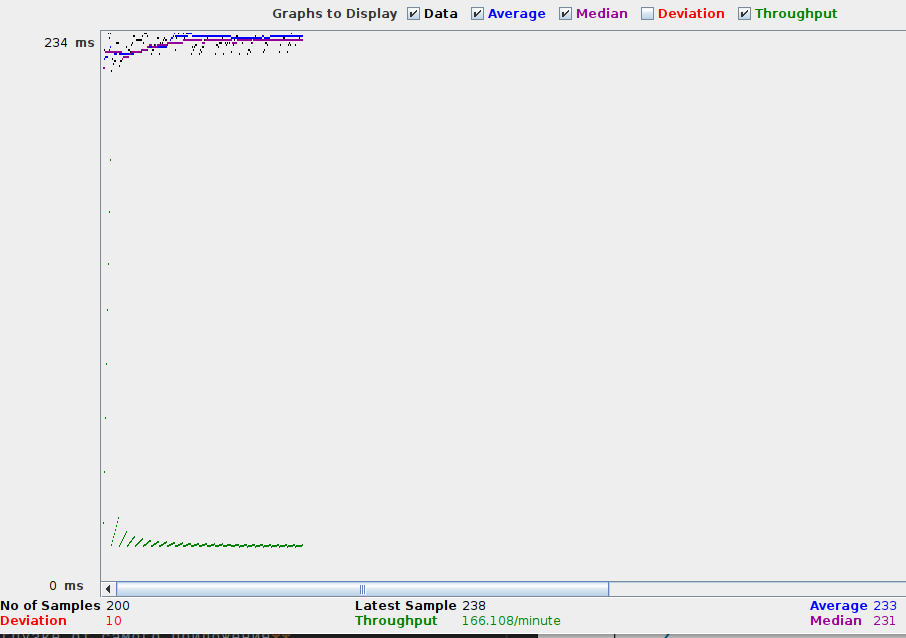
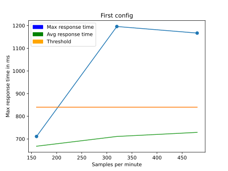
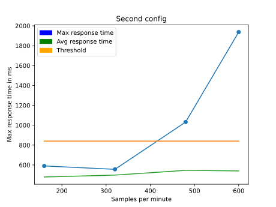
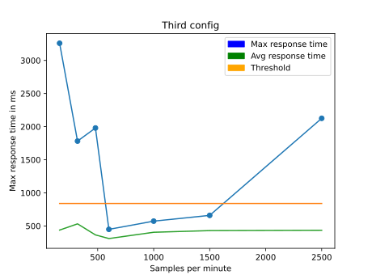

# Лабораторная работа №4

# Задачи
- В ходе нагрузочного тестирования необходимо протестировать 3 конфигурации аппаратного обеспечения и выбрать среди них наиболее дешёвую, удовлетворяющую требованиям по максимальному времени отклика приложения при заданной нагрузке (в соответствии с вариантом).

- В ходе стресс-тестирования необходимо определить, при какой нагрузке выбранная на предыдущем шаге конфигурация перестаёт удовлетворять требованиями по максимальному времени отклика. Для этого необходимо построить график зависимости времени отклика приложения от нагрузки.

# Параметры тестируемого приложения
- Стоимость первой конфигурации (2400 bucks) 
- Стоимость второй конфигурации (4400 bucks)  
- Стоимость третьей конфигурации (8300 bucks)
- Максимальное количество параллельных пользователей - 8
- Средняя нагрузка, формируемая одним пользователем - 20 запр. в мин
- Максимально допустимое время обработки запроса - 840 мс

# Дерево тестового плана


# Конфигурация Throughput таймера
Ставим 160 семплов в минуту, так как это как раз и есть 20 запросов в минуту от 8 пользователей.



# Конфигурация Thread Group
Ramp-up period равен нулю, так как мы хотим, что все потоки (пользователи) активировались одновременно.



# Нагрузочное тестирование первой конфигурации (160 семплов в минуту)


# Нагрузочное тестирование второй конфигурации (160 семплов в минуту)


# Нагрузочное тестирование третий конфигурации (160 семплов в минуту)


# Стресс-тестирование первой конфигурации


**Информация о нагрузке от самого приложения**
```bash
#1 config 320 samples
load:   5,10 r/s
response time:    641 ms
max response time:   1320 ms
```
Как видно из информации представленной выше самая дешевая конфигурация справляется с заданной средней нагрузкой.
При двукратной нагрузке среднее значение времени отклика остается в пределах порога, но иногда происходят недопустимые пики.

# Стресс-тестирование второй конфигурации


**Информация о нагрузке от самого приложения**
```bash
#2 config 160 samples
load:   2,50 r/s
response time:    418 ms
max response time:   1320 ms
```
Конфигурация за 4400 долларов справляется с двукратной нагрузкой гораздо лучше, чем самая дешевая, а также обладает еще большим
запасом прочности.

# Стресс-тестирование третей конфигурации


**Информация о нагрузке от самого приложения**
```bash
#3 config 600 samples
load:  10,20 r/s
response time:    300 ms
max response time:   1320 ms
```
Конфигурация за 8300 долларов показала противоречивые результаты. При относительно небольшой нагрузке происходили недопустимые
пики во времени ответа, а также среднее время ответа было больше, чем у прошлых двух конфигураций. Однако, запас "прочности"
у этой конфигурации гораздо больше.

# Вывод 
В ходе проведенных нагрузочного и стресс тестирований было выяснено, что вторая конфигурация лучше всего справляется с 
нагрузкой в пределах заданных значений, а также выдерживает двукратную и трехкратную нагрузку.
